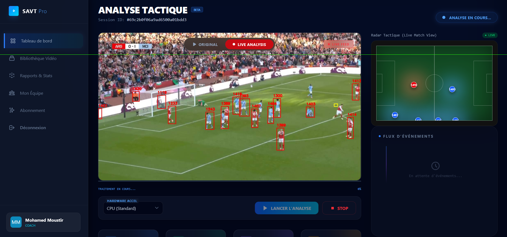
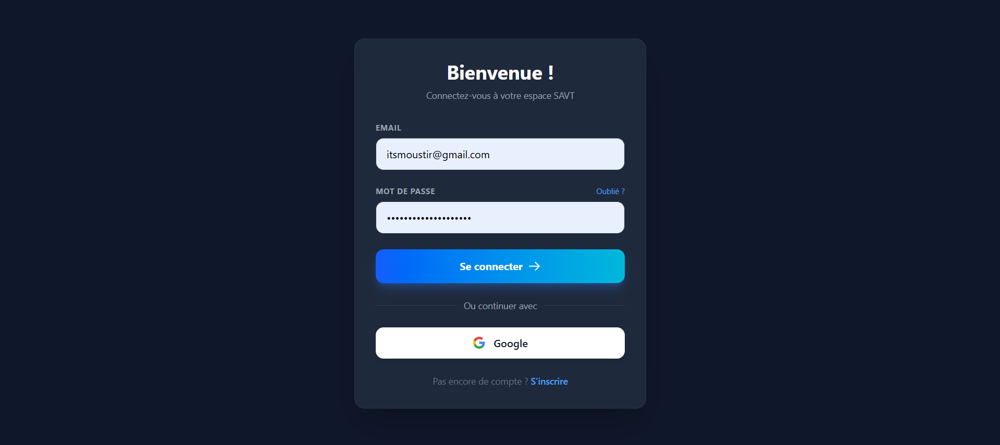
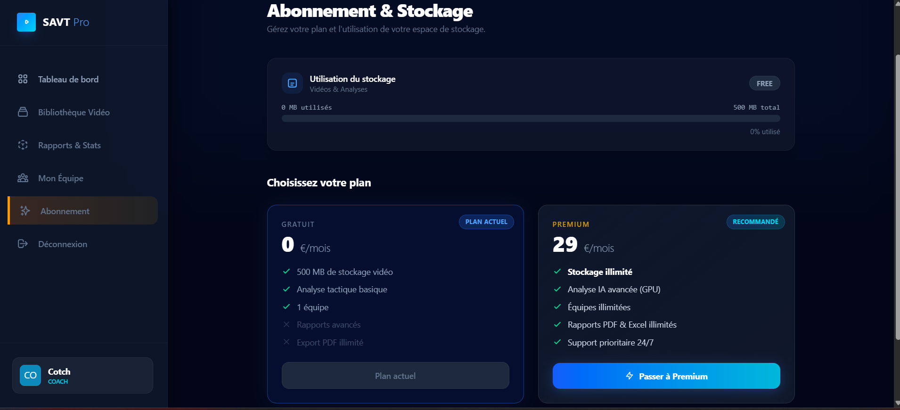

<div align="center">

# ⚽ SAVT — Système d'Analyse Vidéo Tactique

### Plateforme d'analyse vidéo tactique pour le football : tracking des joueurs, statistiques avancées (possession, distance, heatmaps) et analyse automatisée des matchs.

<p>
  
  
  
  
  
</p>

</div>





## 📚 Table des matières

- [À propos du projet](#-à-propos-du-projet)
- [Architecture (High-Level)](#-architecture-high-level)
- [Fonctionnalités](#-fonctionnalités)
- [Stack technique](#-stack-technique)
- [Prérequis](#-prérequis)
- [Installation & Démarrage](#-installation--démarrage)
- [Captures d'écran](#-captures-décran)
- [Auteur & Contact](#-auteur--contact)

---

## 🎯 À propos du projet

Les staffs techniques passent encore beaucoup de temps à analyser manuellement les matchs, ce qui limite la rapidité de prise de décision.

**SAVT** répond à ce besoin en proposant une plateforme complète qui :
- automatise l’analyse vidéo tactique via IA,
- suit les joueurs en mouvement,
- calcule des KPIs exploitables en coaching (possession, distance, heatmaps),
- centralise les résultats dans un dashboard interactif.

✅ **Valeur ajoutée** : transformer une vidéo brute en insights tactiques actionnables, rapidement et à grande échelle.

---

## 🏗 Architecture (High-Level)

SAVT repose sur une architecture modulaire orientée micro-services :

* 🌐 **Nginx :** Agit comme reverse proxy et point d’entrée unique pour sécuriser et router les requêtes.
* 💻 **Angular (Frontend) :** Fournit l’interface utilisateur réactive (upload, visualisation vidéo, analytics).
* ⚙️ **Spring Boot (Backend) :** Expose les APIs sécurisées (JWT), gère la logique métier, l'upload des fichiers lourds et interagit avec MongoDB.
* 🧠 **Python + YOLOv8 (IA) :** Moteur de Computer Vision qui traite les vidéos en arrière-plan pour la détection et le tracking des joueurs.

---

## 🚀 Fonctionnalités

* 🎥 **Upload vidéo lourd** (jusqu’à 5GB) avec traitement asynchrone en arrière-plan.
* 🤖 **Détection & tracking IA** des joueurs sur le terrain avec YOLOv8.
* 📊 **Dashboard analytique** interactif avec KPIs en temps réel (taux de victoire, distance parcourue).
* 🔐 **Sécurité JWT complète** avec gestion stricte des rôles (Coach, Admin).
* 📦 **Déploiement conteneurisé** prêt pour la production via Docker.

---

## 🧰 Stack technique

| Domaine | Technologies |
| :--- | :--- |
| **Frontend** | Angular 17+, Tailwind CSS, NgRx (SignalStore) |
| **Backend** | Java 17, Spring Boot 3, Spring Security (JWT) |
| **Base de données** | MongoDB |
| **Intelligence Artificielle**| Python, YOLOv8, OpenCV |
| **Infrastructure / DevOps** | Docker, Nginx (Reverse Proxy), Linux |

---

## ✅ Prérequis

Assurez-vous d’avoir installé sur votre machine :
- **Node.js** 18+ (recommandé LTS)
- **Java JDK** 17+
- **Maven** 3.9+
- **Python** 3.10+
- **MongoDB** 6+

---

## 🛠 Installation & Démarrage

### 1. Cloner le repository

```bash
git clone [https://github.com/mohamed-moustir/SAVT.git](https://github.com/mohamed-moustir/SAVT.git)
cd SAVT
```

### 2. Démarrer le Backend (Spring Boot)

Configuration des variables d'environnement dans `application.yml` :

```yaml
spring:
  data:
    mongodb:
      uri: ${SPRING_DATA_MONGODB_URI:mongodb://localhost:27017/savt_db}
jwt:
  secret-key: ${JWT_SECRET_KEY:votre_cle_secrete_tres_longue_ici}
upload:
  path: ${UPLOAD_DIR:/uploads/}
```

Lancement via Maven :
```bash
cd backend
mvn clean install
mvn spring-boot:run
```

### 3. Démarrer le Frontend (Angular)

```bash
cd frontend
npm install
ng serve
```
L'application sera disponible sur `http://localhost:4200`.

### 4. Démarrer le Service IA (Python)

```bash
cd ai-service
python -m venv venv
source venv/bin/activate  # Sur Windows: venv\Scripts\activate
pip install -r requirements.txt
python main.py
```

---

## 📸 Captures d'écran

*Remplacez les liens ci-dessous par les vrais chemins de vos images une fois le projet publié.*


*Interface du Dashboard Analytique*


*Vue détaillée du lecteur vidéo et du tracking des joueurs*

---

## 👨‍💻 Auteur & Contact

**Mohamed Moustir**
- GitHub : [@mohamed-moustir](https://github.com/mohamed-moustir)
- Email : itsmoustir@gmail.com
- Projet réalisé dans le cadre de la formation de développeur Full-Stack.

---
*Si ce projet vous plaît, n'hésitez pas à laisser une ⭐️ sur ce repository !*
